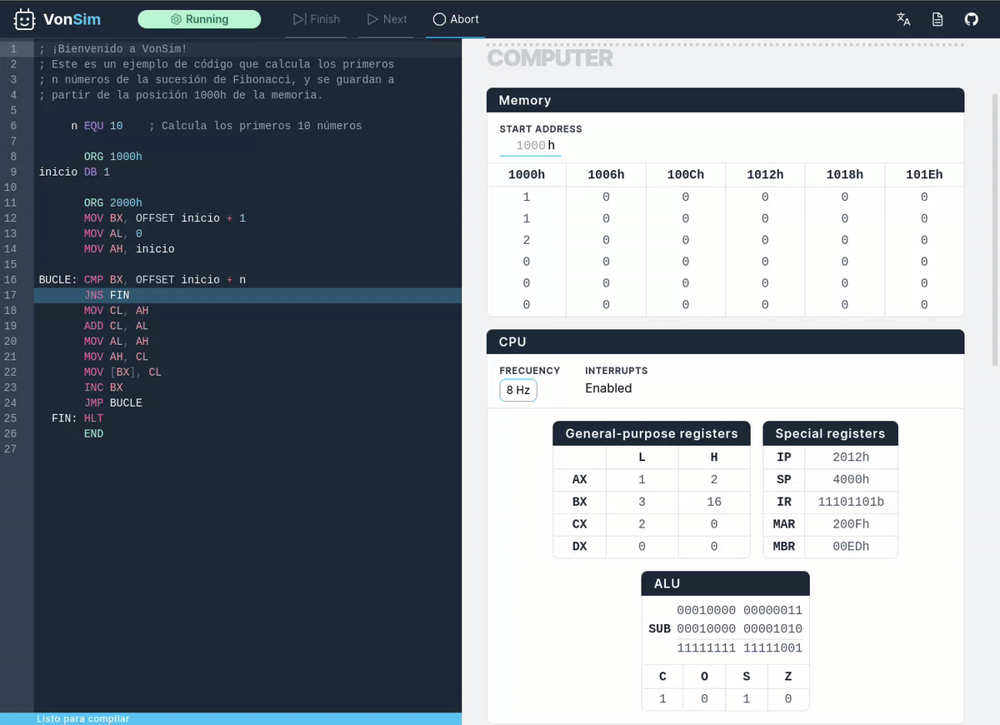

<a href="https://vonsim.github.io/preview" target="_blank" rel="noopener">
  
</a>

<div align="center">
  <br/>
  <h3><a href="https://vonsim.github.io/preview" target="_blank" rel="noopener"><strong>Try it now</strong></a></h3>
  <br/>
  
  <br/>
</div>

## To-do list

- [x] Finish basic implementation
- [x] Devices
  - [x] Hardware interrupts
  - [x] Lights and Switches
  - [x] Printer
  - [x] Printer w/Handshake
- [ ] Support indirect access with offset
- [ ] Add custom VonSim syntax to docs
- [x] Add mobile support
- [ ] Add advanced filesave support
- [ ] Add ✨ animations ✨
- [ ] Perf measurements

More suggestions: https://github.com/vonsim/vonsim/issues/26

## Development setup

You'll need [Node.js v18](https://nodejs.org/) and [pnpm v7](https://pnpm.io). Once you have them installed, you can run the following inside the repo:

```bash
$ pnpm install # only the first time, install the dependencies
$ pnpm dev     # starts the development server
```

More info about this project in [CONTRIBUTING.md](CONTRIBUTING.md)
